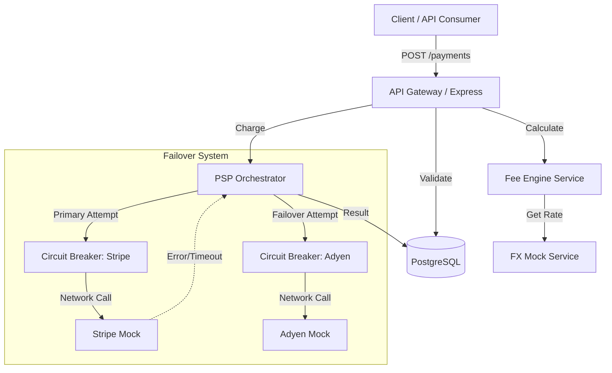
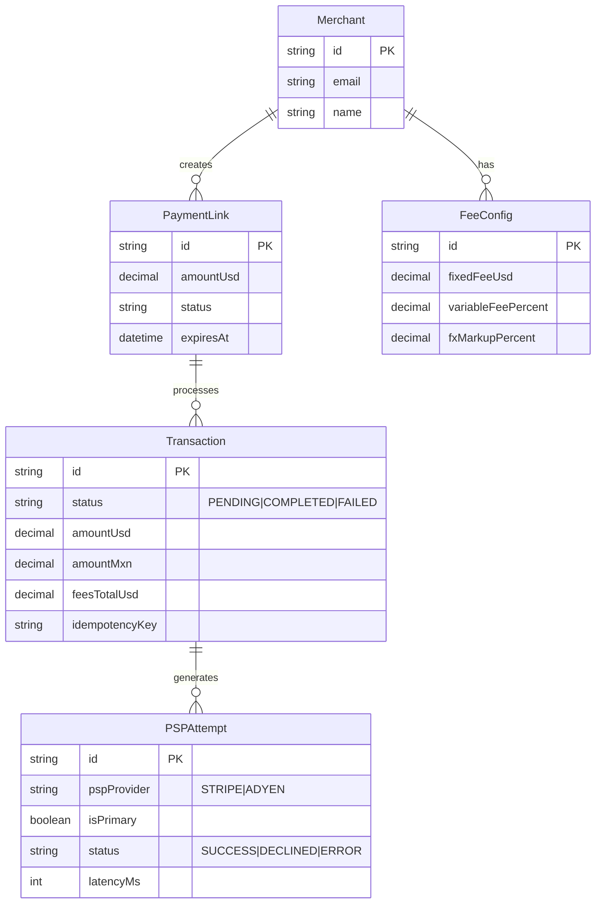

# Kira Payment Orchestrator API

**Challenge Context (24h Sprint)**
This project was built under a strict 24-hour timebox. Due to this constraint, a strategic decision was made to prioritize Backend robustness, financial integrity (ACID), and orchestration logic over Frontend implementation and complex Infrastructure-as-Code (Terraform). The goal was to deliver a solid transactional core capable of handling money, failures, and currency conversion securely.

## Project Description

A Cross-Border Payment Orchestration backend (USD to MXN) that manages Payment Links, complex fee calculations, real-time FX conversion, and intelligent routing between PSPs (Stripe and Adyen) with automatic failover mechanisms.

## Architecture and Design

The system follows a simplified Clean Architecture approach, emphasizing separation of concerns (Controllers, Domain Services, Data Access via Prisma).

### High-Level Data Flow



### Database Schema (ERD)

The data model is designed for strict auditability. Every attempt to charge a card is recorded, separating the abstract concept of a `Transaction` from the concrete technical `PSPAttempt`.



## Strategic Trade-offs and Key Decisions

**1. Backend First vs. Full Stack**
*   **Decision:** Invest 90% of the time in the fee engine, concurrency, and PSP error handling.
*   **Rationale:** In Fintech, a UI glitch is a minor issue; a calculation error or a double charge is a financial and legal liability. The highest technical risk lies in the orchestration layer, so resources were allocated there.

**2. Infrastructure (Render Blueprint vs. Terraform)**
*   **Decision:** Used `render.yaml` (Declarative IaC) instead of raw Terraform modules.
*   **Rationale:** For a 24h MVP, Render provides zero-config deployment, managed Postgres, and automatic SSL. This allowed focusing on business logic while still maintaining reproducible infrastructure.

**3. FX and Fee Management**
*   **Strategy:** Real-time rates with simulated Jitter (volatility).
*   **Implementation:** The `FeeCalculationService` encapsulates all financial logic. Decimal types are used in the database and Prisma to prevent floating-point errors common in money calculations.

**4. Resiliency Patterns**
*   **Pattern:** In-memory Circuit Breaker.
*   **Logic:** If a PSP fails repeatedly, the system stops trying it temporarily to prevent cascading latency, triggering an immediate failover to the secondary provider.

## Implemented Features

*   **Dynamic Fee Engine:** Supports fixed fees, variable fees (%), and FX markup. Includes logic for incentives (e.g., first N transactions free).
*   **Dual-PSP Routing:** Primary attempt (Stripe) with automatic failover to secondary (Adyen) on technical errors (5xx/Timeout), while respecting business errors (Decline 402).
*   **Circuit Breaker:** Protection against downtime from upstream providers.
*   **Idempotency:** Prevents double charges using unique `idempotencyKey`.
*   **Realistic Simulation:** PSP Mocks feature variable latency and configurable success rates via environment variables.
*   **Full Audit Trail:** Normalized relational model recording every single interaction via `psp_attempts`.

## Setup and Execution

### Prerequisites
*   Node.js 18+
*   Docker and Docker Compose (Recommended)

### Option A: Docker Compose (Fastest)

Spins up both the PostgreSQL database and the API with one command.

```bash
# 1. Start services
docker-compose up -d --build

# 2. View logs (to observe mock activity)
docker-compose logs -f api
```

The API will be available at: `http://localhost:3000`

### Option B: Local Development

```bash
# 1. Install dependencies
npm install

# 2. Configure environment
cp .env.example .env

# 3. Start Database (Requires local Postgres or Docker container)
# Ensure DATABASE_URL in .env points to your DB

# 4. Run migrations and seed
npx prisma migrate dev
npm run prisma:seed

# 5. Start in watch mode
npm run dev
```

## API Walkthrough (Manual Testing)

Since there is no Frontend UI, use this guide to test the complete End-to-End flow using `curl` or Postman.

### 1. Health Check
Verify the system and database are online.

```bash
curl http://localhost:3000/health
```

### 2. Create a Payment Link
Simulates the merchant creating a charge request.

```bash
curl -X POST http://localhost:3000/payment-links \
  -H "Content-Type: application/json" \
  -d '{
    "merchantId": "merchant_default", 
    "amountUsd": 100.00, 
    "description": "Technical Consulting",
    "feeConfigOverride": {
        "fixedFeeUsd": 0.50,
        "variableFeePercent": 0.03,
        "fxMarkupPercent": 0.015,
        "firstTxFreeCount": 0
    }
  }'
```
*Note: Copy the `id` from the response for the next steps.*

### 3. Get Fee Preview (Simulating Checkout Load)
The frontend would call this to display how much the user pays and how much the merchant receives in MXN.

```bash
# Replace LINK_ID with the ID obtained in the previous step
curl "http://localhost:3000/payment-links/LINK_ID?withFeePreview=true"
```
*Note: The `feePreview` field shows the breakdown and the current `fxRate` (which varies slightly on each call due to simulated Jitter).*

### 4. Process Payment (Happy Path)
Simulates the user submitting their card token.

```bash
curl -X POST "http://localhost:3000/payment-links/LINK_ID/payments" \
  -H "Content-Type: application/json" \
  -d '{
    "cardToken": "tok_mock_stripe_visa_001",
    "pspProvider": "STRIPE",
    "idempotencyKey": "unique_key_12345",
    "metadata": { "email": "client@example.com" }
  }'
```

### 5. Simulate Failure and Failover (Chaos Testing)
To test resiliency, you can configure the environment variables in `docker-compose.yml` or `.env`:

*   `STRIPE_MOCK_SUCCESS_RATE=0.0` (Force Stripe failure)
*   `ADYEN_MOCK_SUCCESS_RATE=1.0` (Ensure Adyen success)

When retrying the payment (with a new `idempotencyKey`), you will see in the response:
*   `pspProvider: "ADYEN"` (Indicates successful failover).
*   In the console logs: `[Orchestration] Primary STRIPE failed... attempting failover to ADYEN`.

## Roadmap and Future Improvements

If this project were to continue towards production, these would be the immediate priorities:

1.  **Frontend SPA:** Implement the checkout UI in Angular/React consuming the existing endpoints.
2.  **Integration Tests (E2E):** Implement a test suite using `Supertest` to automatically validate failover scenarios and concurrency.
3.  **Security:** Implement HMAC signature validation for Webhooks and JWT authentication for merchant endpoints.
4.  **Cloud Infrastructure:** Migrate from Render to Terraform (AWS) with ECS for the API and RDS Multi-AZ for the database.

## Project Structure

```
src/
├── config/             # Configuration and Env vars
├── controllers/        # HTTP Request handling
├── services/           # Domain Business Logic
│   ├── psp/            # Stripe and Adyen Mocks
│   ├── fee-calculation # Fee Engine
│   ├── fx.service.ts   # FX Rate Mock
│   └── psp-orchestration # Failover/Routing Logic
├── validators/         # Zod Schemas
├── middleware/         # Error handling and Validation
└── index.ts            # Entry point
```
Use Arrow Up and Arrow Down to select a turn, Enter to jump to it, and Escape to return to the chat.
