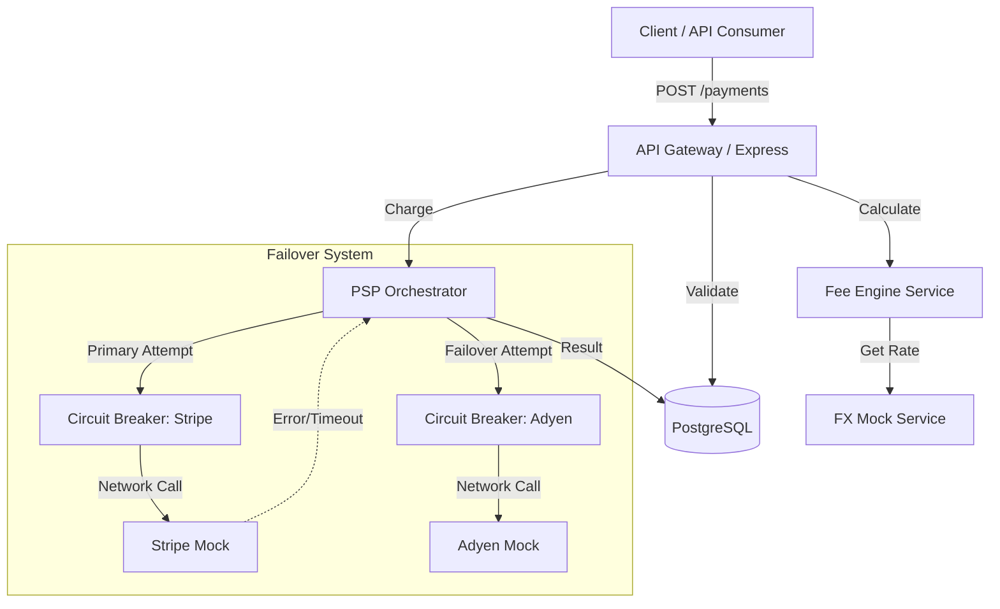
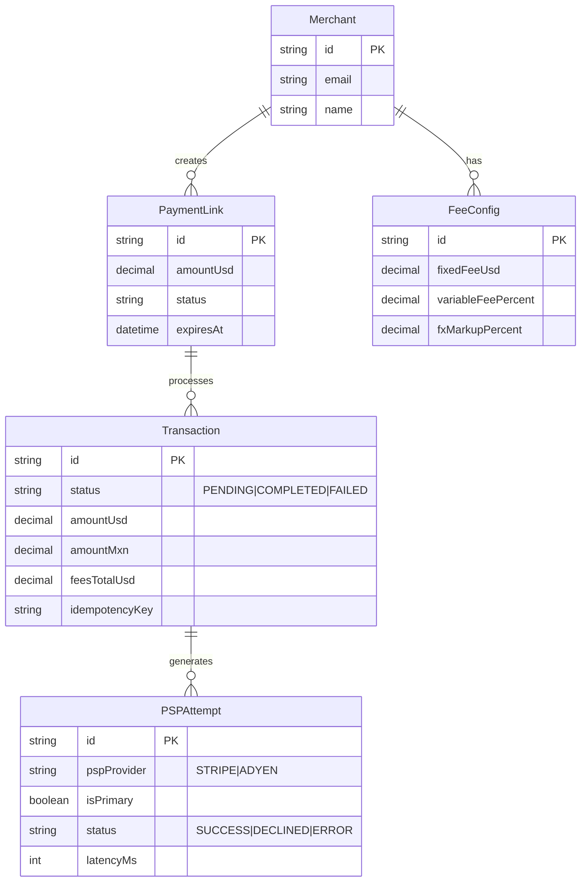

# Kira Payment Orchestrator API

<div align="center">


**High-performance backend for orchestrating cross-border payments with built-in failover and real-time fee calculation.**

[Swagger Docs](http://localhost:3000/api-docs) · [Frontend Repo](https://github.com/judasane/kira-frontend)

</div>

---

## Table of Contents

- [Overview](#overview)
- [Implemented Features](#implemented-features)
- [Architecture and Design](#architecture-and-design)
- [Strategic Trade-offs and Key Decisions](#strategic-trade-offs-and-key-decisions)
- [Tech Stack](#tech-stack)
- [Setup and Execution](#setup-and-execution)
- [API Documentation and Testing](#api-documentation-and-testing)
- [Roadmap and Future Improvements](#roadmap-and-future-improvements)
- [Project Structure](#project-structure)
- [Contributing](#contributing)

---

## Overview

**Challenge Context (24h Sprint)**
This project was built under a strict 24-hour timebox. Due to this constraint, a strategic decision was made to prioritize Backend robustness, financial integrity (ACID), and orchestration logic over Frontend implementation and complex Infrastructure-as-Code (Terraform). The goal was to deliver a solid transactional core capable of handling money, failures, and currency conversion securely.

A Cross-Border Payment Orchestration backend (USD to MXN) that manages Payment Links, complex fee calculations, real-time FX conversion, and intelligent routing between PSPs (Stripe and Adyen) with automatic failover mechanisms.

---

## Implemented Features

*   **Dynamic Fee Engine:** Supports fixed fees, variable fees (%), and FX markup. Includes logic for incentives (e.g., first N transactions free).
*   **Dual-PSP Routing:** Primary attempt (Stripe) with automatic failover to secondary (Adyen) on technical errors (5xx/Timeout), while respecting business errors (Decline 402).
*   **Circuit Breaker:** Protection against downtime from upstream providers.
*   **Idempotency:** Prevents double charges using unique `idempotencyKey`.
*   **Realistic Simulation:** PSP Mocks feature variable latency and configurable success rates via environment variables.
*   **Full Audit Trail:** Normalized relational model recording every single interaction via `psp_attempts`.

---

## Architecture and Design

The system follows a simplified Clean Architecture approach, emphasizing separation of concerns (Controllers, Domain Services, Data Access via Prisma).

### High-Level Data Flow



### Database Schema (ERD)

The data model is designed for strict auditability. Every attempt to charge a card is recorded, separating the abstract concept of a `Transaction` from the concrete technical `PSPAttempt`.



---

## Strategic Trade-offs and Key Decisions

**1. Backend First vs. Full Stack**
*   **Decision:** Invest 90% of the time in the fee engine, concurrency, and PSP error handling.
*   **Rationale:** In Fintech, a UI glitch is a minor issue; a calculation error or a double charge is a financial and legal liability. The highest technical risk lies in the orchestration layer, so resources were allocated there.

**2. Infrastructure (Render Blueprint vs. Terraform)**
*   **Decision:** Used `render.yaml` (Declarative IaC) instead of raw Terraform modules.
*   **Rationale:** For a 24h MVP, Render provides zero-config deployment, managed Postgres, and automatic SSL. This allowed focusing on business logic while still maintaining reproducible infrastructure.

**3. FX and Fee Management**
*   **Strategy:** Real-time rates with simulated Jitter (volatility).
*   **Implementation:** The `FeeCalculationService` encapsulates all financial logic. Decimal types are used in the database and Prisma to prevent floating-point errors common in money calculations.

**4. Resiliency Patterns**
*   **Pattern:** In-memory Circuit Breaker.
*   **Logic:** If a PSP fails repeatedly, the system stops trying it temporarily to prevent cascading latency, triggering an immediate failover to the secondary provider.

---

## Tech Stack

| Category | Technology |
|----------|-----------|
| **Framework** | Express.js |
| **Language** | TypeScript |
| **ORM** | Prisma |
| **Database** | PostgreSQL |
| **Validation** | Zod |
| **API Docs** | OpenAPI (Swagger) |
| **Deployment** | Docker, Render |

---

## Setup and Execution

### Prerequisites
*   Node.js 18+
*   Docker and Docker Compose (Recommended)

### Option A: Docker Compose (Fastest)

Spins up both the PostgreSQL database and the API with one command.

```bash
# 1. Start services
docker-compose up -d --build

# 2. View logs (to observe mock activity)
docker-compose logs -f api
```

### Option B: Local Development

```bash
# 1. Install dependencies
npm install

# 2. Configure environment
cp .env.example .env

# 3. Start Database (Requires local Postgres or Docker container)
# Ensure DATABASE_URL in .env points to your DB

# 4. Run migrations and seed
npx prisma migrate dev
npm run prisma:seed

# 5. Start in watch mode
npm run dev
```
---

## API Documentation and Testing

The API is fully documented using OpenAPI (Swagger). You can explore all the available endpoints, view their schemas, and test them directly from your browser.

When the application starts, it will log the URL for the interactive API documentation to the console. The URL will look something like this:

`http://localhost:3000/api-docs`

If you are running in a cloud development environment (like Firebase Studio or Gitpod), the URL will be the public URL of your workspace.

This interface provides a much more convenient way to understand and interact with the API compared to using manual `curl` commands.

## Roadmap and Future Improvements

If this project were to continue towards production, these would be the immediate priorities:

1.  **Frontend SPA:** Implement the checkout UI in Angular/React consuming the existing endpoints.
2.  **Integration Tests (E2E):** Implement a test suite using `Supertest` to automatically validate failover scenarios and concurrency.
3.  **Security:** Implement HMAC signature validation for Webhooks and JWT authentication for merchant endpoints.
4.  **Cloud Infrastructure:** Migrate from Render to Terraform (AWS) with ECS for the API and RDS Multi-AZ for the database.

---

## Project Structure

```
src/
├── config/             # Configuration and Env vars
├── controllers/        # HTTP Request handling
├── services/           # Domain Business Logic
│   ├── psp/            # Stripe and Adyen Mocks
│   ├── fee-calculation # Fee Engine
│   ├── fx.service.ts   # FX Rate Mock
│   └── psp-orchestration # Failover/Routing Logic
├── validators/         # Zod Schemas
├── middleware/         # Error handling and Validation
└── index.ts            # Entry point
```
